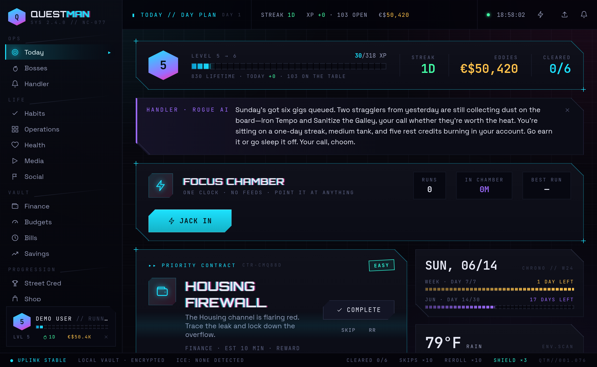
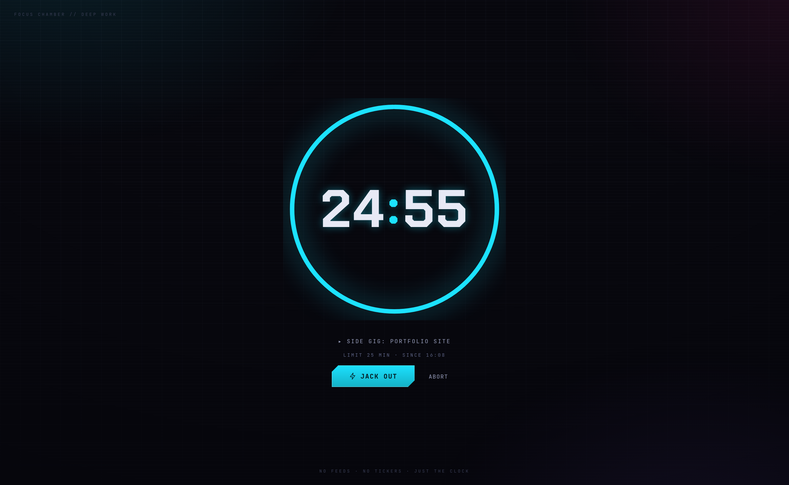
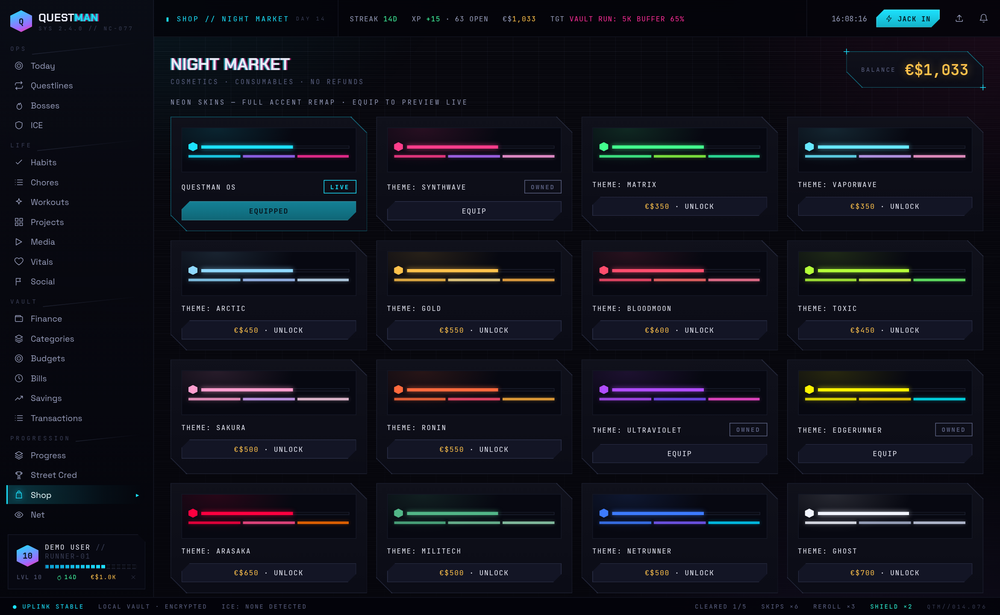
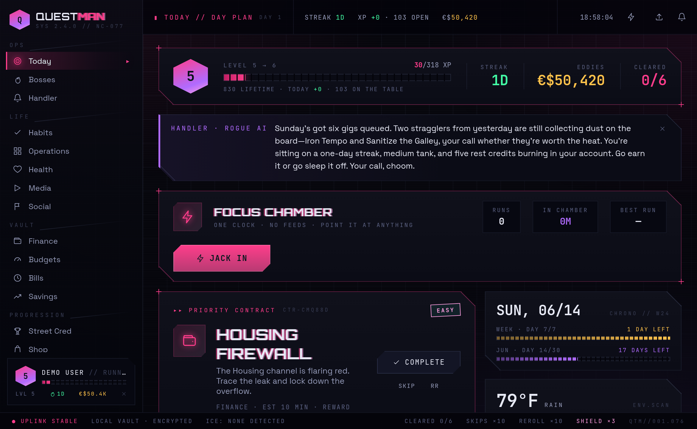
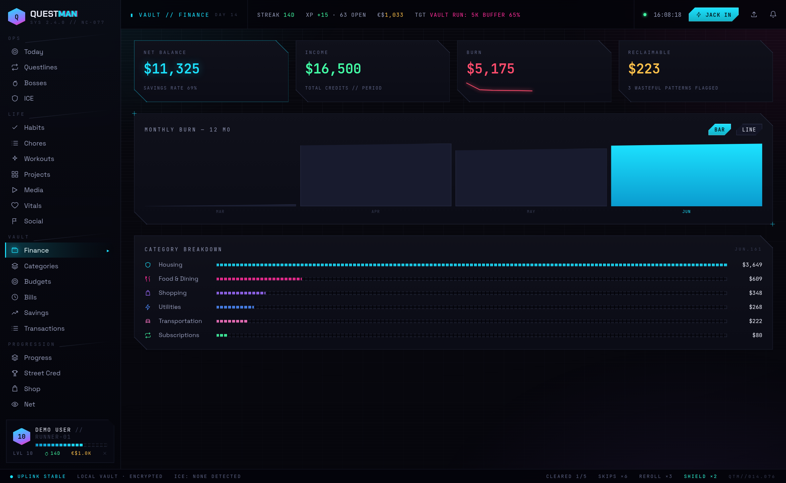
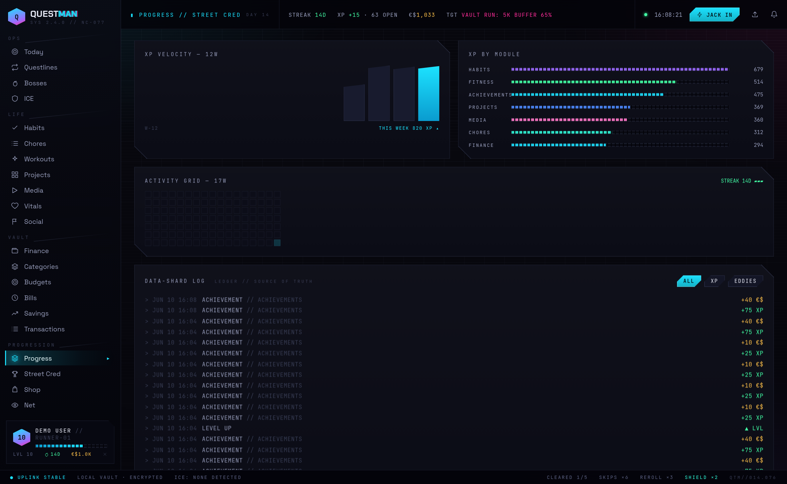

# Questman

A gamified personal **life hub** — daily quests, XP, levels, streaks across
finance, workouts, chores, habits, projects, media consumption, daily vitals, 
and social connections. Self-hosted, single-user, dockerized with a cyberpunk 
aesthetic. Short for *Quest Manager*, with a nod to the Walkman.


*The TODAY board: the day's generated quests ranked by the planner, an AI Handler
briefing, weather-aware scheduling for outdoor chores, and the live session log.*

## Quick start

1. Copy `.env.example` to `.env` and fill in `JWT_SECRET` (use `openssl rand -base64 48`).
   Optionally set `HUB_USER_EMAIL` / `HUB_USER_PASSWORD` to provision your account,
   and `ANTHROPIC_API_KEY` if you plan to turn on the AI features (they ship
   disabled; enable them in-app under SYS // CALIBRATION).
2. `docker compose up -d --build`
3. Open `http://localhost:8080`.

Optional hookups — weather, calendar, and health sync — are covered in
[Integrations](#integrations); what any of it shares with an LLM (spoiler:
nothing without your say-so) is covered in [What the AI sees](#what-the-ai-sees).

## Features

### 🎯 **Quest System**
- AI-generated daily quests via Claude (with deterministic fallback)
- Day planner with time budgeting and priority ranking  
- Progress tracking with counter quests and focus timer
- Carry-over for must-do tasks and quest completion streaks

### 🎮 **Gamification**
- XP and leveling system with `100·n^1.5` progression curve
- Eddies (€$) — spendable currency for rewards
- Streak tracking and overclock multipliers
- Boss fights for major goals and milestones

### 📊 **Life Domains**
- **Finance**: CSV/Excel transaction import, spending analysis, categorization
- **Habits & Chores**: Recurring trackables with weather-aware scheduling
- **Workouts**: Exercise logging with XP rewards
- **Projects**: Task management with milestone tracking
- **Media**: Backlog with auto time-estimation (books, movies, games)
- **Daily Vitals**: Health metrics and biomonitoring
- **Social**: NPC relationship tracking and contact reminders

### 🤖 **AI Integration**
- Claude-powered quest theming and narrative
- Cross-domain insights and pattern analysis
- Weekly retrospective debriefs
- **Off by default, opt-in at every layer**: the AI Calibration panel
  (SYS // CALIBRATION) has a master kill-switch, per-feature toggles, and
  per-domain data-access grants (finance / health / contacts / calendar) —
  all of them start disabled, and sealed domains are never sent to any
  model. Details: [What the AI sees](#what-the-ai-sees)
- Bring your own brain: Anthropic cloud (per-tier model selection) or a local
  LLM via [Ollama](https://ollama.com), plus a configurable daily token cap

## Screenshots

| | |
|:--|:--|
|  **Focus Chamber** — jack in from anywhere for a distraction-free run: count up open-ended, or count down a 15/25/40/55-min limit. Sessions persist and roll up into actual-time-spent per project, habit, chore, or workout. |  **Night Market** — sink your eddies into burnout-relief tokens, consumables, loot crates, and cosmetics: 15 neon skins, display fonts, ambient FX, and focus-timer styles. |
|  **Live reskins** — every purchased skin remaps the whole HUD's accent palette on equip (Synthwave shown). |  **The Vault** — CSV/Excel transaction import with auto-categorization, monthly burn trends, budgets, bills, and recurring-drain detection. |


*Street Cred: XP velocity, per-module lifetime XP, the activity grid, and the
immutable data-shard ledger every grant is written to.*

## Layout

| Dir | What |
|---|---|
| `backend/` | Node + Express + Prisma (SQLite) + Socket.io + JWT. Quest engine, gamification core. |
| `web/` | React 19 + Vite frontend. Cyberpunk design system. |
| `docker-compose.yml` | Two services + persistent SQLite volume. |
| `.env.example` | Documented environment template. |

## Operating

```sh
docker compose up -d --build   # start (and rebuild on code changes)
docker compose logs -f backend # tail backend logs
docker compose down            # stop
docker compose down -v         # stop + wipe the SQLite volume (fresh slate)
```

Dev mode (without Docker): `npm run dev` in `backend/` and `web/`.
Backend on `:3001`, Vite on `:5173`. App at `http://localhost:5173`.

Want something to click around in? `npm run db:seed` in `backend/` creates a
demo account (`demo@questman.app` / `demo123`) with sample data — the same
account the screenshots above use (dressed up via
`backend/src/scripts/dress-readme-demo.ts`).

## Finance Module

### File Upload Format
The finance module accepts CSV or Excel files (.csv, .xlsx, .xls) with three required columns:

| Column | Description | Example |
|--------|-------------|---------|
| **Date** | Transaction date | 2024-01-15, 01/15/2024, January 15, 2024 |
| **Description** | Transaction description | "STARBUCKS SEATTLE WA", "Amazon.com purchase" |
| **Amount** | Transaction amount | -4.50 (expense), +2500.00 (income) |

**Supported date formats**: Most common date formats are automatically detected.  
**Amount format**: Negative for expenses, positive for income. Currency symbols and commas are handled automatically.

### Features
- **Smart Categorization**: Automatic transaction categorization with manual override
- **Spending Analysis**: Interactive charts and trends  
- **Wasteful Spending Detection**: AI-powered insights into spending patterns
- **Advanced Filtering**: Search by date, amount, category, or description

### Privacy & Security
- **Self-hosted**: transactions live in your own SQLite volume on your own
  hardware — no third-party service ever sees them
- **No Tracking**: no analytics or telemetry of any kind
- **AI is opt-in**: finance data only reaches a model if the Vault grant is
  open in AI Calibration — and even then only summaries, never raw
  transactions (see [What the AI sees](#what-the-ai-sees))
- **Open Source**: full transparency in data handling

## Integrations

All integrations are optional, configured in `.env` (each variable is
documented in `.env.example`), and degrade gracefully when unset or
unreachable — the app never blocks on an external feed.

### Weather (Open-Meteo)

- **Setup**: set `HUB_LAT` and `HUB_LON`. No API key — uses Open-Meteo.
- **What it fetches**: today's + tomorrow's forecast for your hub location
  (temps, rain, wind, hourly windows), cached ~2h server-side.
- **What it powers**: outdoor chores/habits only generate quests when their
  weather rule passes; the planner boosts "last clear day" quests; Today
  shows the ENV.SCAN panel.
- **AI exposure**: when Quest Synthesis is on, an outdoor quest's
  best-window hint (e.g. "1–3pm") rides along with the candidate so the
  model can theme the timing. Nothing else.

### Calendar (private ICS feed)

- **Setup**: set `CALENDAR_ICS_URL` to one or more (comma-separated)
  private ICS URLs. For Google Calendar: Settings → *your calendar* →
  "Integrate calendar" → **Secret address in iCal format**. Treat that URL
  like a password — anyone holding it can read your calendar.
- **What it fetches**: today's events (recurrence-aware), polled with a
  15-minute cache. Read-only; Questman never writes to your calendar.
- **What it powers**: the day planner subtracts your real busy time from
  the daily time budget, and Today's GRID SCHEDULE panel shows the agenda
  with a FREE/BUSY readout.
- **AI exposure**: **sealed by default.** Opening the GRID SCHEDULE grant
  in AI Calibration lets the Handler's daily rundown mention commitment
  *counts*, the *next start time*, and *free minutes* — event titles never
  reach any model, grant or no grant.

### Health ingest (Pixel Watch / Health Connect / anything)

- **Setup** — pair the
  [health-connect-webhook](https://github.com/mcnaveen/health-connect-webhook)
  Android app with one of three routes, in order of preference:

  **1. Pull mode (recommended for plain-HTTP hubs).** In the app, enable
  **Local HTTP Server** (default port 8787) and enable the data types you
  want (steps, sleep, resting heart rate, weight, blood pressure,
  hydration). Give your phone a DHCP reservation in your router, then set:

  ```
  HEALTH_PULL_URL="http://<phone-ip>:8787"
  HEALTH_PULL_MINUTES="30"    # optional, default 30
  HEALTH_PULL_TOKEN="<token>" # the app's "Local HTTP auth" bearer token
  ```

  Enable **Local HTTP auth** in the app and copy its token into
  `HEALTH_PULL_TOKEN` — otherwise the phone's health server answers
  anyone on your LAN. The backend polls the phone on that interval and
  quietly retries while the phone is away from home — when it returns,
  the poll widens its lookback window automatically to backfill the gap. Why pull? Android's
  cleartext policy blocks apps from POSTing webhooks to a plain `http://`
  hub, but the phone *serving* HTTP on a trusted LAN is fine.

  **2. Push mode** — if your hub has real HTTPS (e.g. behind Tailscale
  Serve or a Let's Encrypt reverse proxy), set `INGEST_TOKEN` (16+ chars,
  `openssl rand -hex 24`) and point the app's webhook at:

  ```
  https://<your-hub>/api/ingest/health-connect?token=<INGEST_TOKEN>
  ```

  (Token in the URL because the app can't set custom headers — same
  secret-URL trust model as the calendar feed.)

  **3. Generic endpoint** — for any other bridge or script:

  ```sh
  curl -X POST https://your-hub/api/ingest/metrics \
    -H "X-Ingest-Token: $INGEST_TOKEN" -H "Content-Type: application/json" \
    -d '{"entries":[{"date":"2026-06-10","key":"steps","value":9182},
                    {"date":"2026-06-10","key":"sleepHours","value":7.5}]}'
  ```

  All routes share one mapper: steps and hydration are summed per local
  day; sleep is credited to the day you woke up; weight/BP/resting-HR
  take the latest reading of the day. Weight and water are converted to
  the units of your metric definitions (kg→lb, L→oz/ml/glasses) so synced
  values match what you'd log by hand. Raw heart-rate samples are
  ignored. Re-syncing any window is idempotent.
- **What it stores**: plain daily metrics (`date`/`key`/`value` upserts) —
  identical to logging vitals by hand. Re-sending a window is idempotent.
- **What it powers**: vitals quests, the energy tier (from sleep), and the
  cross-domain insights engine.
- **AI exposure**: ingested metrics are ordinary Vitals data, so they are
  governed by the **Biometrics** grant like everything else health-shaped.

## What the AI sees

**Nothing, by default.** Every AI layer ships disabled: the master switch is
off, both AI features (quest synthesis, the Handler) are off, and all four
data-access grants are sealed. A fresh install makes zero LLM calls and
shares zero data. To use AI you opt in deliberately, in SYS // CALIBRATION:

1. Flip the **AI SYSTEMS** master breaker on,
2. enable the features you want (**Quest Synthesis**, **Handler Uplink**),
3. open the data grants you're comfortable with — domain by domain.

Even fully enabled, the AI only ever receives **server-computed summaries**
— it never reads tables, files, or raw history, and it cannot mint XP or
eddies.

| Grant | Default | When OPEN, prompts may include |
|---|---|---|
| **Vault** (finance) | sealed | wasteful-pattern summaries ("subscription, ~$45"), budget/bill reminder candidates, weekly spend total + top category totals. Never raw transactions or imports. |
| **Biometrics** (health) | sealed | vitals/workout quest prompts, energy tier, weekly sleep/mood averages + weight delta, workout count. Never full metric history. |
| **Contacts** (social) | sealed | the most-neglected contact's name + days since contact, "reach out" candidates. |
| **Grid Schedule** (calendar) | sealed | commitment count, next start time, free/busy minutes. Event titles: never, even when open. |

Provider choice (Anthropic cloud vs. local [Ollama](https://ollama.com)) and
the daily token cap apply on top — at the cap, AI yields to the deterministic
fallbacks until midnight. With everything off (the default), every feature
still works; quests use rule-based titles and the Handler stays quiet.
